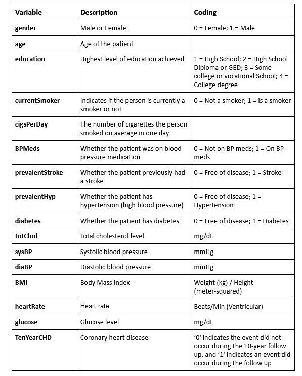

# Data Analysis on Framingham Heart Study- To determine the risk factors of heart disease 

This lab discusses key operations in R for uploading datasets, practice with tidyverse functions for data wrangling, and data visualizations using healthcare data.  
The key goal of the lab is to determine whether a subset of events (mentioned in the data dictionary) associated with chronic heart disease occurred within 10 years of follow up for patients.  

The following packages need to be installed for this lab.

    tidyverse
    tidymodels
    lubridate
    plotly
    skimr
    car
    
About the data:  
    
    The  framinghamHeart.csv data set is used in this lab. The Framingham Heart Study is a long term prospective 
    study of cardiovascular disease among a population of subjects in the community of Framingham, Massachusetts.  

Data Dictionary:  
 

Some of the taks performed in this lab:

    1) Data Exploration
    2) Data Preprocessing
    3) Linear Probability Model with feature selection (using VIF and correlation measures)
    4) Logistic Regression with feature selection (using statistically significant independent variables)
    5) Use test and Validation datasets to determine best model fit
    6) Compare model performance
    

